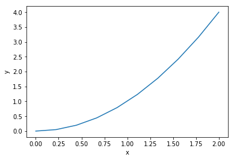

En fuksjon i sin enkleste for kan være for eksempel slik:


```python
from pylab import *
def f(x):
    return x*x
```

Vi kan bruke denne funksjonen for å regne ut fuksjonsverdier, og vi kan plotte verdiene. 


```python

x = linspace(0, 2, 10)
y = f(x)

plot(x, y)
xlabel("x")
ylabel("y")
show()
```





Så funksjoner i programmering er beslektet med funksjoner i matematikken. Eller kanskje mer presist: Vi kan få funksjoner i programmering til å gjøre de tingene som funksjoner i matematikken gjør. Men vi kan også få dem til å gjøre så mye mer!
